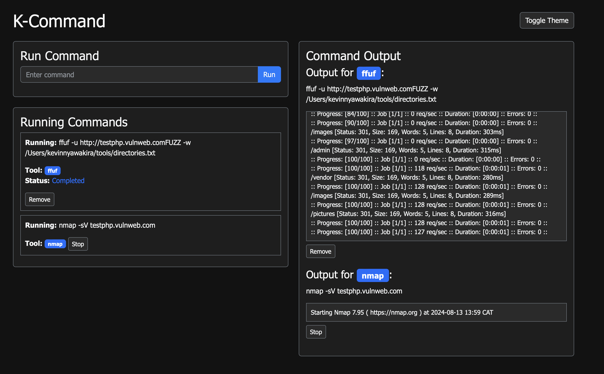

# K-command 🛠️

Your go-to Flask web app for running security tools effortlessly! This app empowers security testers to execute various tools directly from a sleek and intuitive web interface. Get ready to streamline your workflow! 🚀



## Features ✨

- **Run Security Tools:** Easily execute your favorite security tools within the web app.
- **Scan Management:** Start, stop, and remove scans with just a few clicks.
- **Customizable Tool List:** Use the `allowed_tools.yaml` file to specify which tools are available to run.
- **Dark & Light Mode:** Enjoy a stylish dark mode by default, with the option to switch to light mode as needed.

## Getting Started 🚀

### Prerequisites

Make sure you have the following installed:

- Python 3.x
- Flask
- YAML parser (like `pyyaml`)

### Installation

1. **Clone the Repository:**

   ```bash
   git clone https://github.com/kevin81767/K-command.git
   cd k-command
   ```

2. **Install dependencies:**

   ```bash
   pip install -r requirements.txt
   ```

3. **Configure allowed tools:**

   Edit the allowed_tools.yaml file to specify which tools can be run within the app:

   ```bash
   allowed_tools:
    - nmap
    - ffuf
    - katana
   ```
4. **Run the flask app**

    ```bash
    python app.py
    ```
Visit http://127.0.0.1:5000 in your browser to access the app.

### Usage 🖥️

1. **Add Tools**: Ensure your desired tools are listed in the allowed_tools.yaml file.
2. **Run a Scan**: Select the tool, input the necessary parameters, and hit "Run" to start the scan.
3. **Manage Scans**: Use the web interface to stop or remove scans as needed.


### Contributing 🤝

Want to make k-command even better? Contributions are welcome! Fork the repository, make your changes, and submit a pull request.